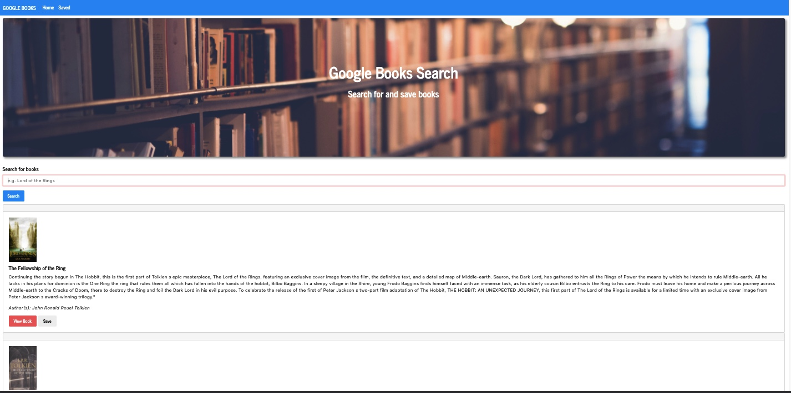

## React Google Books Search

An application using the MERN stack. Users search for books using the Google Books API. Search results are rendered in the front end of the React app, then users have the option to save and/or delete books to a Mongo DB.

View the deployed application at: <b><a href="https://fathomless-dawn-44103.herokuapp.com/" target="_blank">https://fathomless-dawn-44103.herokuapp.com/</a></b>

### Technologies Used
 - React JS
 - MongoDB
 - Mongoose
 - Express JS
 - Node
 - Axios

## How it works

1. Users land on the `Home` page where the search functionality allows them to search for any book. After search, the Google Books API powers the results, which are displayed to the users.

2. After searching for a book relevant results will pop up. Users can click `save` to add the book to the `Saved` page. The book is saved to the Mongo database.

3. User can go to the `Saved` page wherer they will see books that have been saved by them and other users, since there is no log in to identify unique users.

4. A `View Book` button redirects users to the Google Books store page where they can either purchase or read a preview of the book.

5. The `Delete` button to rremoves books from the page, which deletes the document from the Mongo database.

#### Image of Deployed App:   

---

## Installation and Setup Instructions

To view this locally, clone this repository. You will need `node`, `npm`, and `MongoDB` installed globally on your machine. 

Installation:

`npm install`  

To Start Server:

`npm start`  

To Visit App:

`localhost:3000`  

---